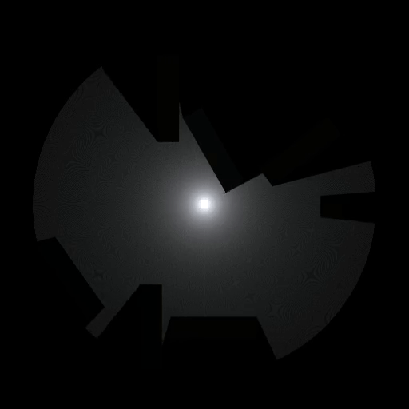

# optimized-2d-ray-tracing
2d raytracing, but optimized using mesh generation!
This sricpt can be used to cast rays on the edges of nearby objects and then filling the space between the rays by generating a mesh in realtime. The mesh can be given a material made using a transparent shader which can be used to give it a natural look.

  

